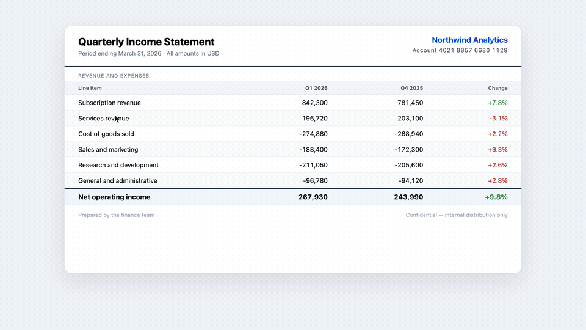

# ScreenShotPP

**A fast, native screenshot tool for macOS and Windows.**

Capture. Annotate. OCR. Copy. Done.

[Download for macOS](https://github.com/xVc323/ScreenShotPP/releases/latest) ·
[Download for Windows](https://github.com/xVc323/ScreenShotPP/releases/latest)



## Why ScreenShotPP?

ScreenShotPP is a lightweight open-source screenshot utility built for a fast daily
workflow. Trigger a global shortcut, select a region, annotate it, extract text with
native OCR when needed, then copy or save the result.

## Features

- Fast region capture on the monitor under your cursor
- Floating annotation toolbar
- Rectangles, ellipses, lines, arrows, freehand drawing and text
- Numbered bubbles for tutorials and documentation
- Mosaic tool for hiding sensitive information
- Native OCR on macOS and Windows
- Copy to clipboard or save to disk
- PNG and JPEG output with optional size targets
- Configurable global shortcut and persistent settings
- Menu bar / system tray background app

## Keyboard shortcut

The default capture shortcut is:

| Platform | Shortcut |
|---|---|
| macOS | `⌘ ⇧ 2` |
| Windows | `Ctrl ⇧ 2` |

You can change it from the ScreenShotPP settings window.

## Installation

### macOS

1. Download the latest `.dmg` from [GitHub Releases](https://github.com/xVc323/ScreenShotPP/releases/latest).
2. Open the DMG and drag ScreenShotPP into `Applications`.
3. Launch ScreenShotPP and grant Screen Recording permission when macOS asks.

### Windows preview

1. Download the latest NSIS `.exe` installer from [GitHub Releases](https://github.com/xVc323/ScreenShotPP/releases/latest).
2. Run the installer.
3. If Microsoft SmartScreen warns about the unsigned preview build, verify that the
   installer comes from this repository, then choose **More info** → **Run anyway**.

The Windows installer will be signed in a future release. The project will apply to
[SignPath Foundation](https://signpath.org/) after the first public release.

## Roadmap

- Mac App Store release
- Microsoft Store release
- Signed Windows GitHub installer

The GitHub version remains free and includes the complete feature set.

## Development

### Prerequisites

- [Node.js 22](https://nodejs.org/)
- [Rust](https://www.rust-lang.org/tools/install)
- Tauri platform prerequisites:
  [macOS](https://v2.tauri.app/start/prerequisites/#macos) or
  [Windows](https://v2.tauri.app/start/prerequisites/#windows)

### Run the checks

```bash
npm ci
cargo test --manifest-path src-tauri/Cargo.toml --lib
node --test src/accelerator.test.js src/editable-target.test.js src/editor/history.test.js src/editor/color.test.js src/editor/bubbles.test.js src/editor/editor.test.js src/editor/mosaic.test.js
```

### Build locally

```bash
npm run tauri build
```

Local macOS builds use the development signing identity configured in
`src-tauri/tauri.conf.json`. Public macOS releases are signed and notarized by GitHub
Actions with a Developer ID Application certificate.

## Contributing

Issues and pull requests are welcome. Please run the Rust and frontend checks before
submitting a change.

## License

[MIT](LICENSE)
